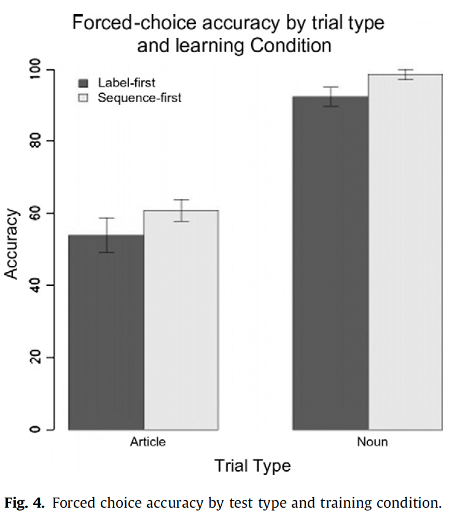
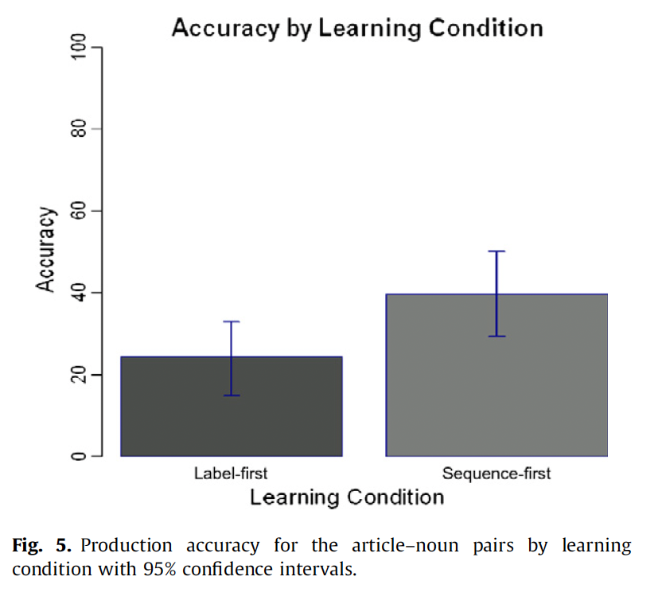

#Brief summary
- The article of Arnon & Ramscar (2012) focused on how adult L2 learners learn grammatical gender. Specifically, if they benefit more from instruction to article-noun sequences or nouns in isolation. 

- Using an artificial language, 32 college-level students (divided in 2 groups) were exposed 14 novel nouns divided into two lexical classes representing two genders: the articles were *sem* and *bol*. 

- The participants were exposed to the novel words using visual and audio stimuli, each noun was linked to an object. 

- After training (20 mins), they completed a judgement task and production task.  

- **Research questions:** 
Does the size of the linguistic units presented to leaerners as determiner-noun vs noun affect what gets learned? Does the order of exposure matter?

---

#Methods

- They conducted a mixed-effect regression model. 

- They identified the predictors that might have affected participants' accuracy performance, which were trial type (correct or incorrect det-noun /noun) and learning condition (exposure to det-noun or noun first) as fixed effects. Then, subjects and items were selected as random effects. 

- While it seems like they did not select the correct statistical approach for a binary response *(see next slide)*, they might have interpreted that a linear-mixed effect model would have given them the main effect to prove that learning condition (article-noun vs noun in isolation) had a main effect. 

---
#Appropriateness/novelty of analysis

- As recently learned in class, accuracy is best analyzed with logistic regression, and this article used a mixed-effect regression model, which is not suited for a binary answers (correct/incorrect responses). Instead, they used accuracy to fit a model that assumes that the data is continuous, which is not appropriate for the type of data. 

- No information is provided regarding a link function (logit) or family type. 

- The paper does not explicitly state what type of software or package was used. 

---
#Presentation of results I

- They explained the result of their mixed-effect regression in general terms, stating a main effect for learning condition and no significant interaction with trial type. No description or information is provided about the random effects.

- They only provide a coefficient value β value for one predictor: exposure to article-noun. This does not allow to compare with trial type which affects the credibility of the effect and overall results.

- Then, they provided accuracy results with percentages for each trial condition article-noun or noun for the judgement task. Also, they report post hoc tests to compare between groups but only for the article-noun condition. They should have reported both conditions. 

- The results of the production task includes accuracy percentages for both groups and only one coefficient for the article-noun learning condition. 

---
#Presentation of results II

- In summary, they interpret that the main effect of learning condition (article-noun) and overall higher accuracy for that group, provides support to the idea that exposure to article-noun vs noun in isolation benefits L2 learners. While their statistical analysis is lacking key components, the trends for accuracy seem credible and their interpretation might be correct but it is not backed up with the linear-mixed model. 

---

#Plot 1
- The color of the bars represent participants trained with nouns (label-first) first and article-noun sequence first, and the bars show whether they were more accurate at identifying the correct article-noun (versus an incorrect article) or selected the correct noun for an object.  

---
#Plot 2
The second graph shows accuracy in the production task, the bars show participants exposed to noun first (label first) and sequence article-noun (sequence first)

---
#What I liked and did not like

- Overall, I only liked that their accuracy results allow to answer the main research question, showing that exposure to article-noun pairs yields better results than presenting nouns in isolation for grammatical gender. 

- They did not approach their statistical analysis with the most appropriate method (logistic regression), which explains why they only report coefficients, SE, p-values for only one predictor, ignoring the results for the other fixed effect. Also, they provided no information about the random effects. 

- They did not provide details about the software used to run their analysis or packages, which obscures replicability. 

- Despite of the flaws of their statistical analysis, this article has hundreds of citations because of their implications in grammatical gender instruction. 
---
#References

Arnon, I., & Ramscar, M. (2012). Granularity and the acquisition of grammatical gender: How order-of-acquisition affects what gets learned. Cognition, 122(3), 292-305.

